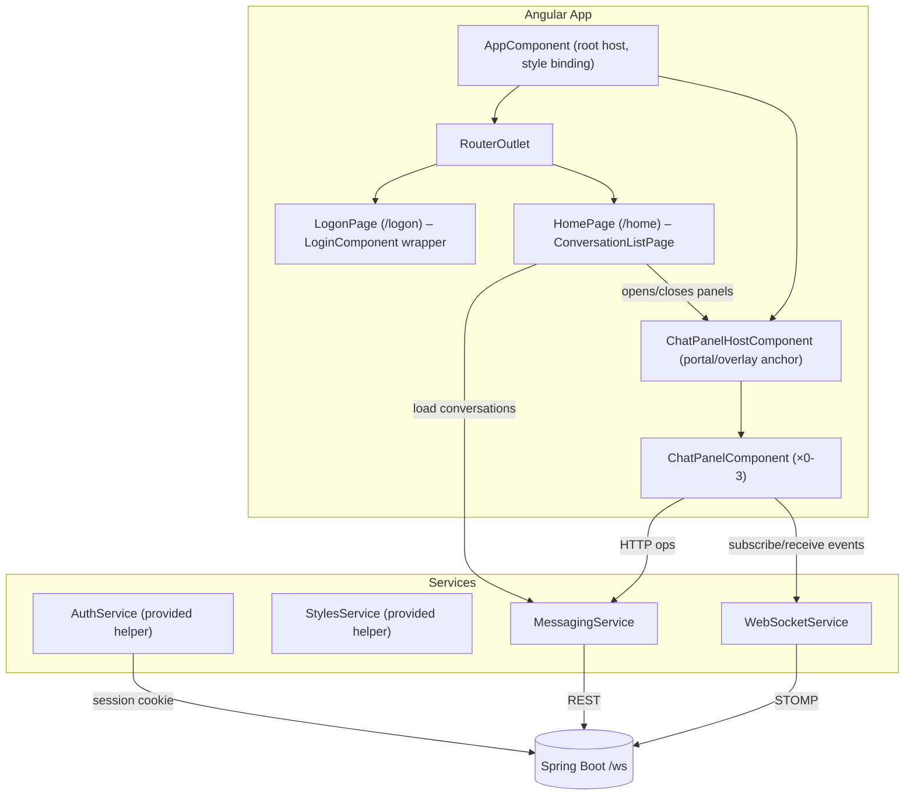
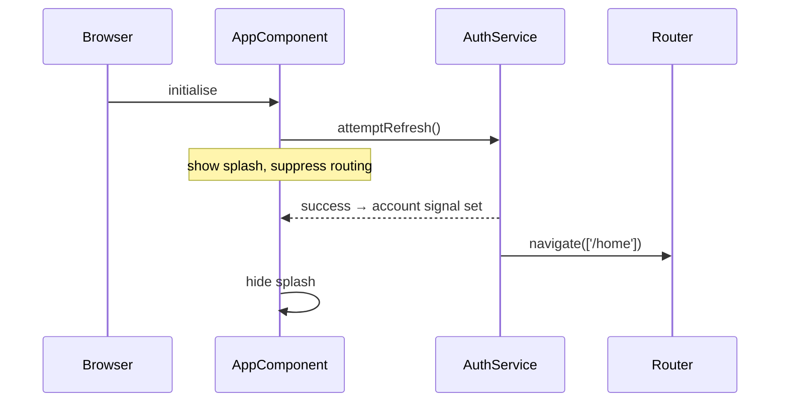
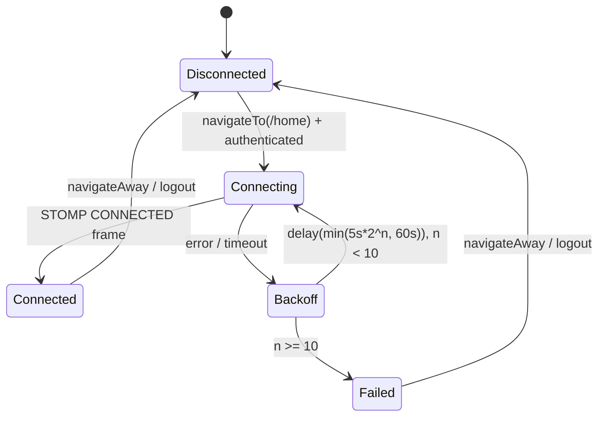

# Design Document: Angular Messaging Frontend

## Overview

This document describes the technical design for an Angular 21 standalone-component messaging application located in the `frontend-base` folder. The application lets authenticated users view conversations and exchange messages in real time, using a floating chat-panel UX pattern (similar to Facebook or LinkedIn Messenger). It integrates with a Spring Boot/WebFlux backend over REST HTTP and STOMP over WebSocket.

Key design goals:
- Reuse the existing `AuthService`, `StylesService`, and `environment` patterns from the helper files without modification.
- Maintain a single, shared STOMP connection for all open panels.
- Keep all WebSocket concerns isolated in `WebSocketService` so the rest of the application uses a clean Observable/Signal interface.
- Use Angular Signals as the primary reactive primitive for component-level state, falling back to RxJS Observables only at service boundaries where streaming or multicasting is needed.

---

## Architecture

The application is structured as a set of **routed pages**, **overlay panels**, and **injectable services**. There is no NgModule; everything is declared as a standalone component.



### Routing

| Path | Component | Guard |
|------|-----------|-------|
| `/logon` | `LogonPageComponent` (wraps `LoginComponent`) | none |
| `/home` | `ConversationListPageComponent` | `authGuard` |
| `**` (wildcard) | redirect → `/logon` | none |

`authGuard` is a functional guard that reads `AuthService.account()`. If the signal is `undefined` it redirects to `/logon`; otherwise it allows navigation.

### Bootstrap Sequence



On error `attemptRefresh()` navigates to `/logon` internally (per the helper implementation). `AppComponent` uses a `loading` signal (initially `true`) that is set to `false` once the first non-pending value is observed on the `AuthService.account` signal, so the splash is shown for exactly the duration of the in-flight request.

---

## Components and Interfaces

### AppComponent

**Responsibilities:**
- Binds `[class]` to `StylesService.style` signal on the `:host` element.
- Calls `AuthService.attemptRefresh()` on `ngOnInit`.
- Manages a `loading: Signal<boolean>` that gates rendering of `<router-outlet>`.
- Renders `<app-chat-panel-host>` outside the router outlet so panels survive navigation between sub-routes.

**Template sketch:**
```html
<div [class]="stylesService.style()">
  @if (loading()) {
    <app-splash-screen />
  } @else {
    <router-outlet />
    <app-chat-panel-host />
  }
</div>
```

---

### LogonPageComponent

A thin wrapper that imports and renders the provided `LoginComponent` directly. No additional logic.

---

### ConversationListPageComponent

**Responsibilities:**
- On `ngOnInit`: calls `MessagingService.getConversations()`.
- Manages `conversations: Signal<Conversation[]>`, `loadingConvs: Signal<boolean>`, `convError: Signal<string | null>`.
- Sorts conversations by `latestActivity` descending (nulls last) before display.
- Emits a panel-open request to `ChatPanelHostComponent` via a shared `PanelManagerService` when the user clicks a conversation entry.
- Displays relative-time `latestActivity` using a `RelativeTimePipe`.
- Subscribes to `WebSocketService.conversationUpdates$` to update `latestActivity` and unread counts for conversations whose panel is not open.

**Outputs/interactions:**
- Click on a conversation row → calls `PanelManagerService.openPanel(conversation)`.

---

### ChatPanelHostComponent

**Responsibilities:**
- Manages the list of up to 3 open `ChatPanelComponent` instances via `PanelManagerService.openPanels` signal.
- Handles LRU eviction when a 4th panel is requested.
- Lays panels out horizontally anchored to the bottom-right of the viewport.

**Layout:**
- Uses `position: fixed; bottom: 0; right: 0` with a flex row of panels.
- Each panel is 320 px wide; panels are ordered so the most recently focused panel is rightmost.

---

### ChatPanelComponent

**Responsibilities:**
- Receives `@Input() conversation: Conversation`.
- On `ngOnInit`: calls `MessagingService.getMessages(conversationId, 0)` and `WebSocketService.subscribe(conversationId)`.
- On `ngOnDestroy`: calls `WebSocketService.unsubscribe(conversationId)`.
- Manages:
  - `messages: WritableSignal<Message[]>` — displayed message list.
  - `loadingMessages: Signal<boolean>` — initial load indicator.
  - `loadingMore: Signal<boolean>` — pagination load indicator.
  - `sendError: Signal<string | null>`, `sendPending: Signal<boolean>`.
  - `editState: WritableSignal<EditState | null>` — tracks which message is being edited and the draft text.
  - `unreadBadgeCount: WritableSignal<number>`.
  - `isFocused: WritableSignal<boolean>`.
  - `lowestLoadedPage: WritableSignal<number>`.
- Listens to `WebSocketService.eventsFor(conversationId)` Observable and dispatches to `handleNewMessage`, `handleSeen`, `handleReaction`, `handleEdit`.
- Implements scroll logic to determine auto-scroll vs. badge increment.
- Tracks `lastInteractionTime: WritableSignal<Date>` for LRU eviction by updating it on click, scroll, and keydown within the panel.

**Edit state type:**
```typescript
interface EditState {
  messageId: string;
  draft: string;
}
```

---

### PanelManagerService

**Responsibilities:**
- `openPanels: WritableSignal<PanelEntry[]>` — ordered list of open panels (rightmost = most recently focused / most recently opened).
- `openPanel(conversation)` — deduplication check; if already open, moves to rightmost and focuses; if 3 are open and new conversation, evicts LRU then opens; updates `lastInteractionTime`.
- `closePanel(conversationId)` — removes from list.
- `focusPanel(conversationId)` — moves panel to rightmost position and sets `isFocused`.
- `updateLastInteraction(conversationId)` — called by ChatPanelComponent on user interactions.

```typescript
interface PanelEntry {
  conversation: Conversation;
  lastInteractionTime: Date;
  isFocused: boolean;
}
```

---

### MessagingService

HTTP service for all REST calls. Uses `HttpClient` with `withCredentials: true`.

| Method | HTTP | URL |
|--------|------|-----|
| `getConversations()` | GET | `/Conversations?appId={appId}` |
| `createConversation(profileIds)` | POST | `/Conversations?appId={appId}` |
| `getMessages(convId, page)` | GET | `/Messages?conversationId={id}&page={n}` |
| `getLatestMessages(convId, since)` | GET | `/Messages/latest?conversationId={id}&time={iso}` |
| `sendMessage(convId, text)` | POST | `/Messages?conversationId={id}` (body: plain text) |
| `markSeen(messageIds)` | PATCH | `/Messages/seen` (body: `string[]`) |
| `reactToMessage(messageId, emoji)` | PATCH | `/Messages/react?messageId={id}` (body: plain text) |
| `editMessage(messageId, text)` | PUT | `/Messages?messageId={id}` (body: plain text) |

All methods return `Observable<T>` to callers.

---

### WebSocketService

**Responsibilities:**
- Creates and manages a single `@stomp/stompjs` `Client` instance.
- Exposes `eventsFor(conversationId: string): Observable<ConversationEvent>` via a `Subject`-based multicast.
- Exposes `connectionStatus$: Observable<WebSocketConnectionStatus>` for panels to display connection state.
- Implements exponential backoff reconnect logic.
- Manages a pending-subscription queue (max 50, 30 s timeout).

**Connection lifecycle:**


**Backoff formula:**
```
delay(attempt) = min(5000 * 2^(attempt - 1), 60000)  // milliseconds
```
Where `attempt` counts from 1. Attempts 1–10 are retried; after attempt 10 the service emits `WebSocketConnectionStatus.FAILED` and stops.

**Subscription queue:**
When `subscribe(conversationId)` is called while `Connected = false`, the request is added to a pending queue (max 50 entries). A 30-second timeout starts on the first queued item; if the connection is not established within 30 s, the entire queue is drained and each entry's panel is notified of subscription failure.

**STOMP configuration:**
```typescript
const client = new Client({
  brokerURL: `${environment.message_service_url}/ws`,
  connectHeaders: {},
  webSocketFactory: () => new WebSocket(
    `${environment.message_service_url}/ws`,
    { withCredentials: true } as any
  ),
  reconnectDelay: 0 // backoff managed manually
});
```

*Note:* Browser `WebSocket` API does not support `withCredentials` natively. The session cookie is included automatically by the browser for same-origin or CORS-credentialed requests when the WebSocket URL is on the same origin (or when the Angular dev proxy forwards requests). The `withCredentials` STOMP connect-header approach is the documented pattern for Spring Security STOMP authentication via cookie; the service passes `withCredentials: true` on the underlying HTTP upgrade by using the `webSocketFactory` override.

---

### RelativeTimePipe

Angular Pipe that converts an `OffsetDateTime` string (ISO-8601) to a human-readable relative string such as "2 minutes ago", "just now", "3 hours ago". Uses `Date` arithmetic relative to `Date.now()`.

```typescript
@Pipe({ name: 'relativeTime', standalone: true })
export class RelativeTimePipe implements PipeTransform {
  transform(value: string | null | undefined): string { ... }
}
```

---

### AuthGuard

Functional route guard:

```typescript
export const authGuard: CanActivateFn = () => {
  const auth = inject(AuthService);
  const router = inject(Router);
  if (auth.account() === undefined) {
    return router.createUrlTree(['/logon']);
  }
  return true;
};
```

---

## Data Models

TypeScript interfaces mirroring the backend Java models:

```typescript
// ---- Conversation ----
export interface ConversationMarker {
  messageId: string;
  messageMade: string;       // ISO-8601 OffsetDateTime
  previousMessages: number;
}

export interface Conversation {
  id: string;
  apps: string[];
  profiles: string[];        // participant profile UUIDs
  currentPage: number;
  markers: ConversationMarker[];
  level: number;
  messageBase?: string;
  // derived on the frontend:
  latestActivity?: string;   // ISO-8601, taken from last marker's messageMade
}

// ---- Message ----
export interface MessageVersion {
  message: string;
  made: string;              // ISO-8601 OffsetDateTime
}

export interface Reaction {
  seen: string;              // ISO-8601 OffsetDateTime
  reaction: string;
}

export interface Message {
  id: string;
  conversationId: string;
  profile: string;           // author profile UUID
  firstMade: string;         // ISO-8601 OffsetDateTime
  messageVersions: MessageVersion[];
  page: number;
  reactions: { [profileId: string]: Reaction };
  conversationIdBranch?: string;
}

// ---- WebSocket Events ----
export type EventType =
  | 'NEW_MESSAGE'
  | 'MESSAGE_SEEN'
  | 'MESSAGE_REACTION'
  | 'MESSAGE_EDIT';

export interface ConversationEvent {
  eventType: EventType;
  conversationId: string;
  actorProfileId: string;
  payload: Message | string[] | null;
}

// ---- WebSocket Status ----
export type WebSocketConnectionStatus =
  | 'CONNECTING'
  | 'CONNECTED'
  | 'BACKOFF'
  | 'FAILED'
  | 'DISCONNECTED';

// ---- Panel Manager ----
export interface PanelEntry {
  conversation: Conversation;
  lastInteractionTime: Date;
  isFocused: boolean;
}

// ---- Chat Panel Edit State ----
export interface EditState {
  messageId: string;
  draft: string;
}
```

### Deriving `latestActivity`

The backend does not return a `latestActivity` field directly. The frontend derives it from `Conversation.markers`: the `messageMade` of the last (highest) element in the sorted `markers` array is used as `latestActivity`. This derivation happens in `MessagingService.getConversations()` after the HTTP response arrives.

### Reaction Count Aggregation

`Message.reactions` is a `{ [profileId: string]: Reaction }` map. To render per-emoji counts, the frontend aggregates:

```typescript
function aggregateReactions(reactions: { [k: string]: Reaction }): Map<string, number> {
  const counts = new Map<string, number>();
  for (const r of Object.values(reactions)) {
    counts.set(r.reaction, (counts.get(r.reaction) ?? 0) + 1);
  }
  return counts;
}
```

---

## Correctness Properties

*A property is a characteristic or behavior that should hold true across all valid executions of a system — essentially, a formal statement about what the system should do. Properties serve as the bridge between human-readable specifications and machine-verifiable correctness guarantees.*

---

### Property 1: Conversation list renders one entry per conversation

*For any* array of `Conversation` objects returned by the API, the rendered conversation list shall contain exactly as many entries as the array, and each entry shall display the conversation `id` and the participant count (`profiles.length`).

**Validates: Requirements 2.2**

---

### Property 2: Conversation sort order — latestActivity descending, nulls last

*For any* array of `Conversation` objects with arbitrary `latestActivity` values (some ISO-8601 timestamps, some absent), the sort function shall produce an array where every conversation with a `latestActivity` appears before every conversation without one, and within the timestamped group all entries are ordered from newest to oldest.

**Validates: Requirements 2.5**

---

### Property 3: RelativeTimePipe produces a non-empty relative string

*For any* valid ISO-8601 timestamp string, `RelativeTimePipe.transform` shall return a non-empty string that is distinct from the raw timestamp (i.e., a human-readable approximation, not the raw ISO value).

**Validates: Requirements 2.6**

---

### Property 4: LRU eviction selects the panel with the oldest last-interaction time

*For any* configuration of 3 open panels with arbitrary `lastInteractionTime` values, when a fourth panel is requested, `PanelManagerService.openPanel` shall close exactly the panel whose `lastInteractionTime` is the minimum (oldest) of the three, and shall open the new panel.

**Validates: Requirements 3.3**

---

### Property 5: Exponential backoff delay formula

*For any* reconnect attempt number `n` in the range [1, 10], the computed reconnect delay shall equal `min(5000 × 2^(n−1), 60000)` milliseconds; for `n > 10` no further reconnect shall be scheduled.

**Validates: Requirements 5.3, 5.7**

---

### Property 6: ConversationEvent deserialization round-trip

*For any* `ConversationEvent` object with a valid `eventType`, `conversationId`, `actorProfileId`, and a payload appropriate to that event type, serializing the object to JSON and deserializing it via the frontend's parsing logic shall produce an object deeply equal to the original.

**Validates: Requirements 6.3**

---

### Property 7: Subscription queue — all pending requests sent after connection

*For any* N subscription requests (1 ≤ N ≤ 50) enqueued before the STOMP connection is established, after the connection is established all N SUBSCRIBE frames shall be sent and the queue shall be empty.

**Validates: Requirements 6.4**

---

### Property 8: NEW_MESSAGE appends to end of message list

*For any* existing message list and any valid `Message` delivered via a `NEW_MESSAGE` event, the resulting message list shall contain the new message as its last element, with all previous messages preserved in their original order.

**Validates: Requirements 7.1**

---

### Property 9: NEW_MESSAGE for closed panel updates conversation list

*For any* `NEW_MESSAGE` event for a conversation whose panel is not open, the `ConversationListPageComponent` shall update that conversation's `latestActivity` to the new message's `firstMade` timestamp and increment its unread count by exactly 1.

**Validates: Requirements 7.6**

---

### Property 10: MESSAGE_SEEN updates all matching seen indicators

*For any* `MESSAGE_SEEN` event payload containing a list of message IDs, every displayed message whose `id` appears in that list shall have its seen indicator set to reflect the seen state; messages whose `id` does not appear in the list shall remain unchanged.

**Validates: Requirements 8.1**

---

### Property 11: Read receipt shown iff non-self participant has seen the message

*For any* `Message` with a `reactions` map, the read-receipt indicator shall be visible if and only if the message's backend-tracked seen state includes at least one profile ID that is not the authenticated user's own profile ID.

**Validates: Requirements 8.2**

---

### Property 12: MESSAGE_REACTION and MESSAGE_EDIT replace the matching message

*For any* `MESSAGE_REACTION` or `MESSAGE_EDIT` event carrying an updated `Message`, the displayed message list shall contain the updated `Message` at the position where the original message with the same `id` appeared, and all other messages shall be unmodified.

**Validates: Requirements 9.1, 10.1**

---

### Property 13: Reaction aggregation renders each distinct emoji with correct count

*For any* `reactions` map on a `Message`, `aggregateReactions` shall return a map where each key is a distinct emoji string that appears in the reactions and each value equals the number of `Reaction` entries carrying that emoji; an empty reactions map shall produce an empty result (no reaction section rendered).

**Validates: Requirements 9.2**

---

### Property 14: Edited indicator shown iff message has more than one version

*For any* `Message`, the "edited" indicator shall be visible if and only if `message.messageVersions.length > 1`.

**Validates: Requirements 10.2**

---

### Property 15: Send trims whitespace before posting

*For any* message text string with arbitrary leading or trailing whitespace characters, `MessagingService.sendMessage` shall be called with the trimmed version of that string; a string composed entirely of whitespace shall never trigger a `POST /Messages` call.

**Validates: Requirements 11.2, 11.6**

---

### Property 16: Mark-seen sends all unseen message IDs in a single request

*For any* list of displayed messages where a subset has not been seen by the authenticated user, when the panel gains focus `MessagingService.markSeen` shall be called exactly once with a list containing exactly the IDs of all unseen messages and no others.

**Validates: Requirements 12.1**

---

### Property 17: Reaction API called with correct messageId and emoji

*For any* `messageId` and emoji string selected from the reaction affordance, `MessagingService.reactToMessage` shall be called with exactly those values.

**Validates: Requirements 13.2**

---

### Property 18: Edit affordance visible only for messages authored by current user

*For any* list of `Message` objects displayed in a panel, the edit affordance shall be rendered if and only if `message.profile === authService.currentAccountId`.

**Validates: Requirements 14.1**

---

### Property 19: Edit confirmation posts trimmed text; whitespace-only body rejected

*For any* non-empty (after trimming) edited text string, `MessagingService.editMessage` shall be called with the trimmed text; for any whitespace-only string the call shall not be made and a validation error shall be shown.

**Validates: Requirements 14.3, 14.4**

---

### Property 20: Root host CSS class matches StylesService.style signal

*For any* value emitted by `StylesService.style` signal, the CSS class applied to `AppComponent`'s root host element shall equal that value at all times (reactive binding).

**Validates: Requirements 15.1**

---

## Error Handling

| Scenario | Component | Behaviour |
|----------|-----------|-----------|
| `GET /Conversations` fails | `ConversationListPageComponent` | Show error message + retry button; clear loading indicator |
| `GET /Messages` (initial) fails | `ChatPanelComponent` | Hide loading indicator; show inline error |
| `GET /Messages` (pagination) fails | `ChatPanelComponent` | Remove top loading indicator; show inline error at top |
| `POST /Messages` fails | `ChatPanelComponent` | Re-enable input/button; show inline error; retain draft |
| `PATCH /Messages/seen` fails | `ChatPanelComponent` | Log error; do not update seen indicators |
| `PATCH /Messages/react` fails | `ChatPanelComponent` | Re-enable reaction affordance; show inline error on message |
| `PUT /Messages` fails | `ChatPanelComponent` | Stay in edit mode; show inline error; retain draft |
| STOMP initial connection fails (≤10 attempts) | `WebSocketService` | Exponential backoff retry |
| STOMP connection fails (>10 attempts) | `WebSocketService` | Emit `FAILED` status; all open panels show connection-failed banner |
| STOMP mid-session disconnect | `WebSocketService` | Exponential backoff retry; panels show reconnecting indicator |
| STOMP ERROR frame on subscribe | `WebSocketService` | Mark panel subscription-failed; notify panel |
| `NEW_MESSAGE` with invalid payload | `ChatPanelComponent` | Log error; do not modify message list |
| `MESSAGE_SEEN` with invalid payload | `ChatPanelComponent` | Log error; do not modify seen indicators |
| `MESSAGE_REACTION` payload missing/unmatched | `ChatPanelComponent` | Log error; do not modify message list |
| `MESSAGE_EDIT` payload missing/unmatched | `ChatPanelComponent` | Log error; do not modify message list |
| Subscription queue overflow (>50) or 30 s timeout | `WebSocketService` | Discard queue; notify each affected panel |

### Validation Rules

- Sending a message: trimmed body must be non-empty.
- Editing a message: trimmed edited text must be non-empty.
- Both cases show a validation message inline and do not call the API.

---

## Testing Strategy

### Dual Testing Approach

Testing uses both example-based unit tests and property-based tests in a complementary fashion.

- **Unit/example tests** cover specific interactions, loading states, error paths, lifecycle hooks, and integration between components and services.
- **Property-based tests** verify universal invariants across a wide space of generated inputs (sorting, rendering, backoff math, event handling).

### Property-Based Testing Library

The project uses **fast-check** (`npm install --save-dev fast-check`) for property-based testing, integrated with the existing **Jest** (or Jasmine/Karma) test runner.

Each property test runs a minimum of **100 iterations**.

Tag format for each property test:
```
// Feature: angular-messaging-frontend, Property {N}: {property_text}
```

### Test File Organization

```
frontend-base/src/
  app/
    services/
      messaging.service.spec.ts
      websocket.service.spec.ts
      panel-manager.service.spec.ts
    pipes/
      relative-time.pipe.spec.ts
    pages/
      conversation-list/conversation-list.component.spec.ts
    components/
      chat-panel/chat-panel.component.spec.ts
    guards/
      auth.guard.spec.ts
    app.component.spec.ts
```

### Property Tests Summary

| # | File | Property |
|---|------|---------|
| 1 | conversation-list.component.spec.ts | One entry per conversation |
| 2 | conversation-list.component.spec.ts | Sort order |
| 3 | relative-time.pipe.spec.ts | Non-empty relative string |
| 4 | panel-manager.service.spec.ts | LRU eviction |
| 5 | websocket.service.spec.ts | Backoff delay formula |
| 6 | websocket.service.spec.ts | ConversationEvent round-trip |
| 7 | websocket.service.spec.ts | Subscription queue drain |
| 8 | chat-panel.component.spec.ts | NEW_MESSAGE appends to end |
| 9 | conversation-list.component.spec.ts | NEW_MESSAGE closed panel update |
| 10 | chat-panel.component.spec.ts | MESSAGE_SEEN updates indicators |
| 11 | chat-panel.component.spec.ts | Read receipt non-self condition |
| 12 | chat-panel.component.spec.ts | MESSAGE_REACTION / MESSAGE_EDIT replace |
| 13 | chat-panel.component.spec.ts | Reaction aggregation counts |
| 14 | chat-panel.component.spec.ts | Edited indicator condition |
| 15 | chat-panel.component.spec.ts | Send trims whitespace |
| 16 | chat-panel.component.spec.ts | Mark-seen single request |
| 17 | chat-panel.component.spec.ts | Reaction API correct args |
| 18 | chat-panel.component.spec.ts | Edit affordance author-only |
| 19 | chat-panel.component.spec.ts | Edit trim / whitespace reject |
| 20 | app.component.spec.ts | Root host CSS class binding |

### Unit Test Coverage

In addition to the property tests, unit/example tests cover:
- `AppComponent`: splash shown during in-flight refresh; navigates to /home on success; navigates to /logon on failure.
- `authGuard`: allows authenticated users; redirects unauthenticated to /logon.
- `ConversationListPageComponent`: GET called on init; loading indicator shown; error message and retry button on failure; `latestActivity` shown for conversations with markers.
- `ChatPanelComponent`: GET /Messages page=0 on open; loading indicator; pagination trigger hidden at page 0; send button disabled while in-flight; edit mode toggled correctly; cancel edit does not call API.
- `WebSocketService`: connects to correct URL on /home navigation; disconnects on navigate-away and logout; single connection shared across panels.
- `MessagingService`: verifies correct HTTP verbs, URLs, headers, and body serialization for each method.

### Integration Notes

- `WebSocketService` tests mock the `@stomp/stompjs` `Client` to avoid real WebSocket connections.
- `MessagingService` tests use `HttpClientTestingModule` with `HttpTestingController`.
- Property tests that involve DOM assertions use `TestBed` with `ComponentFixture`.
