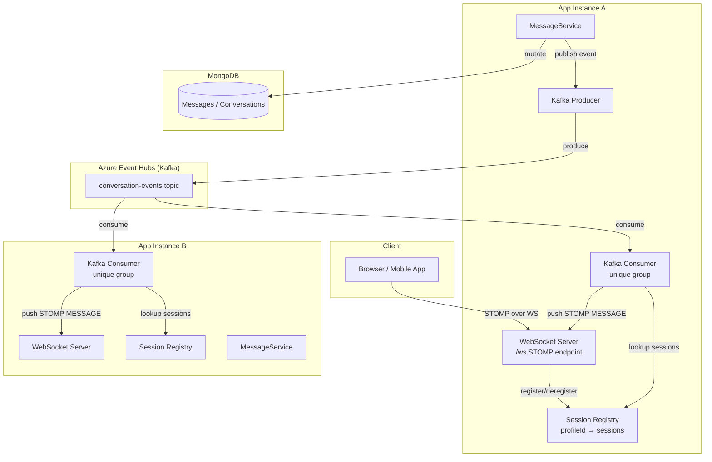

# Design Document: WebSocket Messaging

## Overview

This design migrates the messaging subsystem from HTTP polling to WebSocket-based real-time push delivery. The existing HTTP endpoints remain fully intact; the WebSocket layer is additive.

When any application instance handles a conversation-mutating API call (`POST /Messages`, `PATCH /Messages/seen`, `PATCH /Messages/react`, `PUT /Messages`), it publishes a `ConversationEvent` to an Azure Event Hubs topic via the Kafka-compatible API. Every running instance consumes from that topic using a unique consumer group, so each instance receives every event. Each instance maintains an in-memory `SessionRegistry` mapping `profileId → Set<StompSession>`. On receiving an event, the consumer looks up which locally-connected sessions belong to participants of the affected conversation and are subscribed to that `conversationId`, then forwards the event to those sessions as a STOMP `MESSAGE` frame.

The entire WebSocket/Kafka subsystem is gated behind the `trecapps.messaging.websocket.enabled` flag. When `false`, the application runs in HTTP-only mode with no STOMP endpoint, no Kafka producer, and no Kafka consumer.

### Key Design Decisions

- **No shared session store**: Sessions are in-memory per instance. If a client is connected to instance A and the event is consumed by instance B, instance B simply finds no matching sessions and discards the event. This avoids the complexity of a distributed session store at the cost of guaranteed delivery — which is explicitly out of scope per the requirements.
- **Unique consumer group per instance**: Each instance generates a UUID-suffixed consumer group ID at startup so that every instance receives every event, rather than competing for events in a shared group.
- **Kafka over Azure Service Bus for events**: The existing `IMessageProducer` / `ServiceBusMessageProducer` infrastructure handles push notifications to users. The new Kafka producer/consumer is a separate concern for inter-instance event fan-out and must not be conflated with the notification pipeline.
- **Spring WebFlux + Spring WebSocket (STOMP)**: The application already uses WebFlux. Spring's `WebSocketHandler` API is used for the STOMP endpoint; the `SimpMessagingTemplate` is not used because it requires a broker relay or in-memory broker that does not fit the per-instance routing model. Instead, sessions are tracked explicitly and messages are sent directly via `WebSocketSession.send()`.
- **Authentication at the HTTP handshake, not the STOMP layer**: `TrecSecurityContextReactive` and its underlying `TrecAuthSecurityAsyncParser` are built entirely around `ServerWebExchange` and cannot be used inside a STOMP `ChannelInterceptor`. Instead, authentication is performed in `WebSocketHandshakeInterceptor` during the HTTP upgrade request, where a `ServerWebExchange` is naturally available. The interceptor calls `TrecAuthSecurityAsyncParser.extractAccountInfo()` directly, checks for the `TREC_VERIFIED` authority, and either stores the resolved `profileId` in the WebSocket session attributes (success) or returns `false` to reject the handshake with a `401` (failure). The `StompAuthChannelInterceptor` is then a lightweight guard that simply reads the `profileId` from session attributes and registers the session — it performs no token validation itself.

---

## Architecture



### Event Flow (Happy Path)

1. Client POSTs a new message to Instance A.
2. `MessageService` persists the `Message` to MongoDB.
3. `KafkaConversationProducer` serialises a `ConversationEvent` (type `NEW_MESSAGE`) and publishes it to the Event Hubs topic.
4. Both Instance A and Instance B consume the event from the topic (each has its own consumer group).
5. Each instance's `KafkaConversationConsumer` looks up the `Conversation` participants from MongoDB, then queries its local `SessionRegistry` for sessions belonging to those participants that are subscribed to the `conversationId`.
6. Matching sessions receive the `ConversationEvent` as a STOMP `MESSAGE` frame on `/user/queue/conversations/{conversationId}`.
7. The original HTTP response (`201 Created`) is returned to the caller regardless of Kafka publish success.

---

## Components and Interfaces

### New Components

#### `WebSocketConfig`
- `@Configuration`, `@ConditionalOnProperty(name = "trecapps.messaging.websocket.enabled", havingValue = "true")`
- Registers the STOMP WebSocket endpoint at `/ws` with SockJS fallback disabled (native WebSocket only).
- Registers `WebSocketHandshakeInterceptor` on the `/ws` endpoint to perform authentication during the HTTP upgrade.
- Configures `StompAuthChannelInterceptor` on the inbound channel to enforce that a `profileId` was resolved before allowing a `CONNECT` frame to proceed.
- Configures an `ApplicationListener<SessionDisconnectEvent>` to clean up the `SessionRegistry` on disconnect.

#### `WebSocketHandshakeInterceptor` (implements `HandshakeInterceptor`)
- Injected with `TrecAuthSecurityAsyncParser` directly (not `TrecSecurityContextReactive`).
- In `beforeHandshake(ServerHttpRequest, ServerHttpResponse, WebSocketHandler, Map<String, Object> attributes)`:
  1. Wraps the `ServerHttpRequest` and `ServerHttpResponse` into a `DefaultServerWebExchange` so that `TrecAuthSecurityAsyncParser.extractAccountInfo()` can be called. The parser automatically checks the `Authorization` header first, then falls back to the `trecauth.request.cookie-name` cookie — no duplicate extraction logic is needed here.
  2. Calls `extractAccountInfo(exchange).block()` to resolve the `AccountList`.
  3. If the result is empty or the resolved authentication does not contain the `TREC_VERIFIED` authority, sets the HTTP response status to `401` and returns `false` to abort the handshake.
  4. On success, stores the `profileId` (from `AccountList.getMainAccount().getId()`) in the `attributes` map under the key `"profileId"` and returns `true`.
- `afterHandshake` is a no-op.

#### `StompAuthChannelInterceptor` (implements `ChannelInterceptor`)
- Intercepts `CONNECT` frames on the inbound channel.
- Reads the `"profileId"` value from `SimpMessageHeaderAccessor.getSessionAttributes()`.
- If `"profileId"` is absent (guards against misconfiguration where the handshake interceptor was bypassed), throws `MessagingException` which Spring translates to a STOMP `ERROR` frame and closes the session.
- On success: calls `SessionRegistry.register(profileId, sessionId)` to record the new session.

#### `SessionRegistry`
- `@Component`, `@ConditionalOnProperty(...)`
- Thread-safe in-memory map: `ConcurrentHashMap<UUID, CopyOnWriteArraySet<String>>` where the key is `profileId` and the value is a set of STOMP session IDs.
- Methods:
  - `void register(UUID profileId, String sessionId)`
  - `void deregister(String sessionId)` — removes the session from whichever profileId it belongs to; also removes the profileId entry if the set becomes empty.
  - `Set<String> getSessionIds(UUID profileId)`
- A reverse map `ConcurrentHashMap<String, UUID>` (`sessionId → profileId`) is maintained to support efficient `deregister` by session ID.

#### `SubscriptionRegistry`
- `@Component`, `@ConditionalOnProperty(...)`
- Thread-safe in-memory map: `ConcurrentHashMap<String, Set<UUID>>` where the key is STOMP session ID and the value is the set of `conversationId` UUIDs the session is subscribed to.
- Methods:
  - `void subscribe(String sessionId, UUID conversationId)`
  - `void unsubscribe(String sessionId, UUID conversationId)`
  - `void removeSession(String sessionId)` — removes all subscriptions for a session on disconnect.
  - `boolean isSubscribed(String sessionId, UUID conversationId)`

#### `StompSubscriptionController` (implements `@SubscribeMapping` handler or `@MessageMapping`)
- Handles `SUBSCRIBE` frames to `/user/queue/conversations/{conversationId}`.
- Validates that the authenticated `profileId` (from session attributes) is a participant of the `conversationId` by querying `ConversationRepo`.
- On success: calls `SubscriptionRegistry.subscribe(sessionId, conversationId)`.
- On failure: sends a STOMP `ERROR` frame via `SimpMessagingTemplate` and does not register the subscription.

#### `SessionDisconnectListener` (implements `ApplicationListener<SessionDisconnectEvent>`)
- On disconnect event: calls `SessionRegistry.deregister(sessionId)` and `SubscriptionRegistry.removeSession(sessionId)`.

#### `ConversationEvent`
- Plain Java record / `@Data` class, JSON-serialisable via Jackson.
- Fields: `EventType eventType`, `UUID conversationId`, `UUID actorProfileId`, `Object payload`.
- `EventType` enum: `NEW_MESSAGE`, `MESSAGE_SEEN`, `MESSAGE_REACTION`, `MESSAGE_EDIT`.

#### `KafkaConversationProducer`
- `@Component`, `@ConditionalOnProperty(...)`
- Wraps a Spring `KafkaTemplate<String, String>`.
- Method: `void publishEvent(ConversationEvent event)` — serialises to JSON using `ObjectMapper`, sends to the configured topic. On `KafkaException`, logs the error (including `conversationId` and `eventType`) and returns without rethrowing.

#### `KafkaConversationConsumer`
- `@Component`, `@ConditionalOnProperty(...)`
- Annotated with `@KafkaListener(topics = "${trecapps.messaging.kafka.topic}", groupId = "#{kafkaConsumerGroupId}")`.
- `kafkaConsumerGroupId` is a `@Bean String` that returns `"messaging-ws-" + UUID.randomUUID()` — evaluated once at startup.
- On each record: deserialises JSON to `ConversationEvent`, looks up conversation participants from `ConversationRepo`, queries `SessionRegistry` and `SubscriptionRegistry` for matching sessions, sends the event JSON to each matching session via `SimpMessagingTemplate.convertAndSendToUser(...)`.
- On deserialisation failure: logs the raw record and continues.
- On delivery failure to a session: logs the failure and continues.

#### `KafkaConfig`
- `@Configuration`, `@ConditionalOnProperty(...)`
- Defines `ProducerFactory`, `KafkaTemplate`, `ConsumerFactory`, and `ConcurrentKafkaListenerContainerFactory` beans.
- Reads `trecapps.messaging.kafka.bootstrap-servers` and `trecapps.messaging.kafka.topic`.
- Configures SASL/SSL for Azure Event Hubs (connection string or Entra-based credential).

### Modified Components

#### `MessageService`
- Inject `KafkaConversationProducer` (optional, `@Autowired(required = false)`).
- After each successful mutation, call `producer.publishEvent(event)` if the producer is non-null.
- The reactive chain must not fail if the producer call throws — wrap in a try/catch or use `.doOnSuccess(...)` with error swallowing.

#### `SecurityConfig`
- Add `/ws/**` to the `permitAll()` matcher (WebSocket handshake uses HTTP upgrade; authentication is handled at the STOMP layer by `StompAuthChannelInterceptor`).

#### `application-message.properties`
- Add new properties:
  ```
  trecapps.messaging.websocket.enabled=false
  trecapps.messaging.kafka.topic=${KAFKA_TOPIC:conversation-events}
  trecapps.messaging.kafka.bootstrap-servers=${KAFKA_BOOTSTRAP_SERVERS}
  trecapps.messaging.kafka.connection-string=${KAFKA_CONNECTION_STRING:}
  ```

### Unchanged Components

All existing HTTP controllers (`MessageController`, `ConversationController`), `MessageService` mutation logic, `ConversationService`, MongoDB repositories, and the `IMessageProducer` / `ServiceBusMessageProducer` notification pipeline remain unchanged in their external contracts.

---

## Data Models

### `ConversationEvent`

```java
@Data
@NoArgsConstructor
@AllArgsConstructor
public class ConversationEvent {
    private EventType eventType;      // NEW_MESSAGE | MESSAGE_SEEN | MESSAGE_REACTION | MESSAGE_EDIT
    private UUID conversationId;
    private UUID actorProfileId;
    private Object payload;           // Message, List<UUID>, etc. — type depends on eventType
}
```

Payload by event type:

| `eventType`        | `payload` type      | Content                                      |
|--------------------|---------------------|----------------------------------------------|
| `NEW_MESSAGE`      | `Message`           | Full serialised `Message` object             |
| `MESSAGE_SEEN`     | `List<UUID>`        | List of message IDs whose read status changed |
| `MESSAGE_REACTION` | `Message`           | Updated `Message` with new reaction state    |
| `MESSAGE_EDIT`     | `Message`           | Updated `Message` with new `MessageVersion`  |

### `EventType` Enum

```java
public enum EventType {
    NEW_MESSAGE,
    MESSAGE_SEEN,
    MESSAGE_REACTION,
    MESSAGE_EDIT
}
```

### Session Registry (in-memory, not persisted)

```
SessionRegistry:
  profileId (UUID) → Set<sessionId (String)>
  sessionId (String) → profileId (UUID)   [reverse index]

SubscriptionRegistry:
  sessionId (String) → Set<conversationId (UUID)>
```

### Kafka Record

- **Key**: `conversationId.toString()` (enables partition affinity per conversation, though not strictly required)
- **Value**: JSON-serialised `ConversationEvent`
- **Topic**: value of `trecapps.messaging.kafka.topic`

---

## Correctness Properties

*A property is a characteristic or behavior that should hold true across all valid executions of a system — essentially, a formal statement about what the system should do. Properties serve as the bridge between human-readable specifications and machine-verifiable correctness guarantees.*

### Property 1: Session registration on connect

*For any* valid `profileId` and authentication token, after a successful STOMP `CONNECT` the `SessionRegistry` SHALL contain the new session ID under that `profileId`.

**Validates: Requirements 1.2**

---

### Property 2: Session deregistration on disconnect

*For any* `SessionRegistry` state containing one or more sessions for a `profileId`, disconnecting a session SHALL remove that session ID from the registry and remove all of its subscriptions from the `SubscriptionRegistry`. If it was the last session for that `profileId`, the `profileId` entry SHALL also be absent.

**Validates: Requirements 1.4, 2.4**

---

### Property 3: Multiple sessions per profileId

*For any* `profileId` and any number N ≥ 2 of concurrent sessions, the `SessionRegistry` SHALL hold all N session IDs under that `profileId` simultaneously.

**Validates: Requirements 1.5**

---

### Property 4: Subscription registration and removal round-trip

*For any* session and `conversationId`, subscribing and then unsubscribing SHALL leave the `SubscriptionRegistry` in the same state as before the subscribe — i.e., the session SHALL NOT be subscribed to that `conversationId`.

**Validates: Requirements 2.1, 2.2**

---

### Property 5: Unauthorised subscription rejection

*For any* `profileId` that is not in a conversation's participant list, attempting to subscribe to that `conversationId` SHALL be rejected and the `SubscriptionRegistry` SHALL not record the subscription.

**Validates: Requirements 2.3**

---

### Property 6: Mutation triggers correct event type

*For any* successful conversation mutation (new message, seen, reaction, or edit), the `KafkaConversationProducer` SHALL be called exactly once with a `ConversationEvent` whose `eventType` matches the mutation kind, `conversationId` matches the affected conversation, and `actorProfileId` matches the authenticated caller.

**Validates: Requirements 3.1, 3.2, 3.3, 3.4**

---

### Property 7: Producer failure does not fail the HTTP response

*For any* conversation mutation where the `KafkaConversationProducer` throws an exception, the HTTP response returned to the caller SHALL still be a success response (2xx), and the failure SHALL be logged.

**Validates: Requirements 3.5**

---

### Property 8: Consumer routes only to subscribed participant sessions

*For any* `ConversationEvent` and any `SessionRegistry` / `SubscriptionRegistry` state, the set of sessions that receive the forwarded event SHALL be exactly those sessions whose `profileId` is a participant of the conversation AND that are subscribed to the event's `conversationId`. No other sessions SHALL receive the event.

**Validates: Requirements 4.1, 4.2, 4.3**

---

### Property 9: ConversationEvent serialisation round-trip

*For any* valid `ConversationEvent` (varying `eventType`, `conversationId`, `actorProfileId`, and `payload`), serialising to JSON and then deserialising SHALL produce an object equal to the original.

**Validates: Requirements 5.1, 5.2, 5.3**

---

### Property 10: Invalid JSON is skipped without crash

*For any* byte sequence that is not valid JSON (or valid JSON that does not conform to the `ConversationEvent` schema), the `KafkaConversationConsumer` SHALL not throw an exception and SHALL continue processing subsequent records.

**Validates: Requirements 5.4**

---

### Property 11: Only TREC_VERIFIED tokens may connect

*For any* authentication token (supplied via either the `Authorization` header or the configured cookie) that does not carry the `TREC_VERIFIED` authority, `WebSocketHandshakeInterceptor` SHALL return `false` and the handshake SHALL be rejected with `401`. Additionally, if neither source provides a token, the handshake SHALL be rejected. In both cases no session SHALL be registered.

**Validates: Requirements 6.3, 1.3**

---

## Error Handling

### Kafka Producer Failures

The `KafkaConversationProducer.publishEvent` method catches all exceptions internally. The calling code in `MessageService` is therefore not affected. The failure is logged at `ERROR` level with the `conversationId` and `eventType` to aid diagnosis. No retry is attempted — the event is best-effort.

### Kafka Consumer Deserialisation Failures

If a consumed Kafka record cannot be deserialised into a `ConversationEvent`, the raw record value (as a string) is logged at `ERROR` level and the record is skipped. The Kafka listener does not rethrow, so the consumer continues processing subsequent records without pausing or restarting.

### Kafka Consumer Delivery Failures

If sending a STOMP `MESSAGE` frame to a session fails (e.g., the session closed between the registry lookup and the send), the failure is logged at `WARN` level and processing continues for remaining sessions and subsequent events.

### STOMP Authentication Failures

If the JWT in a `CONNECT` frame is missing, malformed, or expired, `StompAuthChannelInterceptor` throws a `MessagingException`. Spring's STOMP infrastructure translates this into a STOMP `ERROR` frame sent to the client, after which the underlying WebSocket connection is closed. No session is registered.

### Subscription Authorisation Failures

If a client attempts to subscribe to a `conversationId` for which their `profileId` is not a participant, `StompSubscriptionController` sends a STOMP `ERROR` frame to the session. The subscription is not recorded. The session itself remains open.

### WebSocket Disconnect

`SessionDisconnectListener` handles `SessionDisconnectEvent` synchronously. Both `SessionRegistry.deregister` and `SubscriptionRegistry.removeSession` are called. These operations are idempotent — calling them for a session that is already absent is a no-op.

---

## Testing Strategy

### Unit Tests

Unit tests cover specific examples, edge cases, and error conditions for each component in isolation.

- **`SessionRegistry`**: add/remove sessions, multiple sessions per profileId, deregister unknown session (no-op), concurrent access.
- **`SubscriptionRegistry`**: subscribe/unsubscribe, removeSession clears all subscriptions, concurrent access.
- **`WebSocketHandshakeInterceptor`**: valid token in `Authorization` header → `profileId` stored in attributes, returns `true`; valid token in cookie (no header) → `profileId` stored in attributes, returns `true`; invalid/missing token → returns `false` with `401`; token present but missing `TREC_VERIFIED` authority → returns `false` with `401`.
- **`StompAuthChannelInterceptor`**: `profileId` present in session attributes → `SessionRegistry.register` called; `profileId` absent → `MessagingException` thrown.
- **`KafkaConversationProducer`**: successful publish calls `KafkaTemplate.send`; `KafkaException` is caught and logged; HTTP response is unaffected.
- **`KafkaConversationConsumer`**: correct sessions selected for an event; empty match → no send; deserialisation failure → skip and continue; delivery failure → log and continue.
- **`MessageService` integration with producer**: each mutation method calls the producer with the correct `EventType` and payload.

### Property-Based Tests

Property-based tests use [jqwik](https://jqwik.net/) (a JUnit 5 compatible PBT library for Java). Each property test is configured to run a minimum of 100 tries.

Each test is tagged with a comment in the format:
`// Feature: websocket-messaging, Property {N}: {property_text}`

- **Property 1** — `SessionRegistry`: generate random `profileId` + session ID, register, assert session is present.
- **Property 2** — `SessionRegistry` + `SubscriptionRegistry`: generate registry with random sessions and subscriptions, disconnect one, assert session and all its subscriptions are absent.
- **Property 3** — `SessionRegistry`: generate random `profileId` and N ≥ 2 session IDs, register all, assert all are present.
- **Property 4** — `SubscriptionRegistry`: generate random session + `conversationId`, subscribe then unsubscribe, assert not subscribed.
- **Property 5** — `StompSubscriptionController` (with mocked `ConversationRepo`): generate `profileId` not in participant list, attempt subscribe, assert rejection and no subscription recorded.
- **Property 6** — `MessageService` (with mocked `KafkaConversationProducer`): generate random valid message/conversation/profile, call each mutation method, assert producer called with correct `EventType` and matching IDs.
- **Property 7** — `MessageService` (with producer that always throws): generate random mutation input, assert HTTP response is still success.
- **Property 8** — `KafkaConversationConsumer` routing logic (pure function extracted for testability): generate random registry state and `ConversationEvent`, assert delivered sessions == intersection of participants and subscribers.
- **Property 9** — `ConversationEvent` serialisation: generate random `ConversationEvent` instances (all four `EventType` variants, random UUIDs, random payloads), serialise to JSON, deserialise, assert equality.
- **Property 10** — `KafkaConversationConsumer` error handling: generate random byte sequences that are not valid `ConversationEvent` JSON, assert consumer does not throw.
- **Property 11** — `WebSocketHandshakeInterceptor` (with mocked `TrecAuthSecurityAsyncParser`): generate tokens without `TREC_VERIFIED` or with no token at all, assert `beforeHandshake` returns `false` and no session is registered.

### Integration / Smoke Tests

- **Smoke**: Verify `WebSocketConfig` registers the `/ws` endpoint when `trecapps.messaging.websocket.enabled=true`.
- **Smoke**: Verify no WebSocket or Kafka beans are present in the Spring context when `trecapps.messaging.websocket.enabled=false`.
- **Smoke**: Verify the Kafka consumer group ID is unique across two instantiations of `KafkaConfig`.
- **Integration**: End-to-end test using an embedded Kafka broker (via `spring-kafka-test`) — post a message via `MessageService`, assert a `ConversationEvent` is produced to the topic, assert the consumer delivers it to a mock STOMP session.
- **Integration**: Verify existing HTTP endpoint contracts (`GET /Messages`, `POST /Messages`, etc.) are unchanged using `WebTestClient`.
